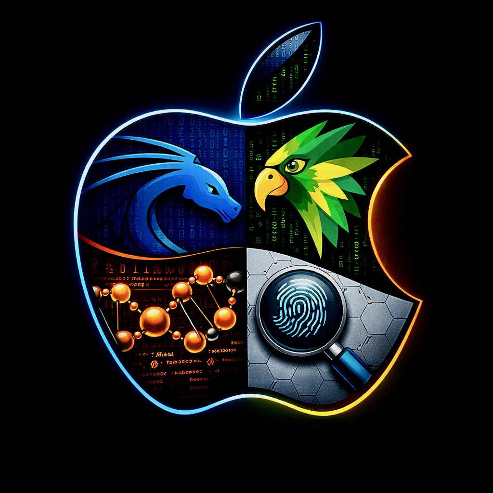

<p align="center">
  
</p>

# Offensive & Forensic Distros Installer for MacBook Air M1/M2 (external disk, LUKS)

A menu-driven installer with support for **several offensive operating
systems** (Kali Linux, Parrot Security OS) **and forensic toolkits**
(SIFT Workstation, REMnux, offered as options under Ubuntu) on an
external USB disk with encrypted partitions, cloned from a
**Debian/Asahi** (for Kali/Parrot) or **Ubuntu/Asahi** (for Ubuntu, and
whichever forensic tools you add on top) base already installed on an
Apple Silicon MacBook Air/Pro (M1/M2). `/boot` (EFI + kernel) stays on
the Mac's internal disk; the root filesystem lives on the external
disk.

```
Debian/Asahi (internal NVMe) ──clones──▶ external USB disk
                                           ├── Kali Linux (its own partitions)
                                           └── Parrot Security OS (its own partitions)

Ubuntu/Asahi (internal NVMe) ──clones──▶ external USB disk
                                           └── Ubuntu (its own partitions)
                                                 ├── + SIFT Workstation (optional)
                                                 └── + REMnux (optional)
```

Both bases are separate, non-converting internal installs — see
["Non-negotiable prerequisite"](#non-negotiable-prerequisite-before-using-this)
below if you want both offensive distros and forensic tools on the same
external disk.

> **CAINE was evaluated and deliberately not implemented**: it ships as
> a modified Live ISO, not as an APT repository that can be added on top
> of an already-cloned base, so it doesn't fit this installer's
> conversion/Salt-states model the way Kali, Parrot, SIFT and REMnux do.
> See [docs/OPERATING_SYSTEMS.md](docs/OPERATING_SYSTEMS.md) for the
> full reasoning.

> ⚠️ **Project status:** actively in development. The scripts are
> functional but not yet meant for "blind" use. Read the risks section
> before running anything.

## Non-negotiable prerequisite before using this

**The MacBook must already have, installed and up to date on its
internal disk (NVMe), the base operating system matching whichever
target you want to clone toward**, before running anything from this
repository:

- **Asahi Linux / Debian** — to clone toward **Kali** or **Parrot**
  (converted by adding their repository on top of this base).
- **Ubuntu Asahi** — to clone toward **Ubuntu** (cloned as-is, no
  conversion; see [ubuntuasahi.org](https://ubuntuasahi.org/)). The
  stable installer may not currently offer **Ubuntu 24.04 LTS** — see
  [docs/OPERATING_SYSTEMS.md](docs/OPERATING_SYSTEMS.md#installing-the-ubuntuasahi-source-base-with-ubuntu-2404-lts)
  for the workaround.

This project **does not install macOS or any of these bases**: it
assumes they already exist and work, and clones whichever one matches
onto an external disk. The installer automatically checks, before
partitioning or cloning, that the booted system matches what the chosen
target requires (see
[docs/OPERATING_SYSTEMS.md](docs/OPERATING_SYSTEMS.md)).

> **If you want both offensive distros and forensic tools on the same
> external disk** (e.g. Kali *and* Ubuntu-with-SIFT/REMnux), you need
> **both bases installed on the internal disk**: Debian/Asahi for
> Kali/Parrot, and Ubuntu/Asahi for the Ubuntu target (which is where
> SIFT and REMnux hang off, see [docs/OPERATING_SYSTEMS.md](docs/OPERATING_SYSTEMS.md)).
> Each OS takes ≈89.5 GB on the external disk (512 MB EFI + 2 GB boot +
> 87 GB root) — **for more than one operating system on the same disk,
> use at least a 500 GB external disk**, not the bare minimum.
> Neither base can be converted into the other after the fact — you
> switch between them by rebooting the Mac and picking the corresponding
> internal boot entry. Note that host steps 00/01/01a will need to be
> repeated once on each base the first time you use it there: they save
> their state to `/var/lib/base_inst_kali/state.conf` **on whichever
> filesystem is currently booted**, and Debian/Asahi and Ubuntu/Asahi are
> two entirely separate installs with separate root filesystems, so one
> base's progress isn't visible from the other.

Follow the official guide if you don't have it yet:
<https://wiki.debian.org/InstallingDebianOn/Apple/M1> (Debian's Bananas
project, based on Asahi Linux's work). This installer's step `00`
checks for signs of that installation (arm64 architecture, `asahi-*`
packages) and warns you if it can't find them, but making sure that
base is ready and up to date is a prerequisite for using this
repository, not something it does for you.

## What does this project do?

It automates and chains together a workflow that today requires
combining several scattered guides and a fair amount of manual
trial-and-error:

- Checks prerequisites, then partitions, encrypts (LUKS) and formats an
  **external USB disk**.
- **Clones** the running system (Debian/Asahi or Ubuntu/Asahi,
  depending on the chosen target) onto that external disk.
- Adds the repositories and metapackages of **Kali Linux** and/or
  **Parrot Security OS** on top of that cloned base, using each
  distribution's official mechanisms, turning it into a full
  penetration-testing distribution bootable from the GRUB menu
  alongside the original system. **Ubuntu**, on the other hand, is
  cloned as-is (no conversion), with the option to add **SIFT
  Workstation (SANS)** and/or **REMnux** on top, for forensics and
  malware analysis respectively.
- Lets you install **more than one operating system on the same
  external disk**, each in its own partitions, without overwriting each
  other's data.
- All of it guided by a **single menu** (`install.sh`) with persistent
  progress (survives the multiple reboots the process requires) and
  per-step **logging**.

## Requirements

- MacBook with an Apple M1 or M2 chip, with Asahi Linux/Debian already
  installed and up to date (see above).
- External hard drive/SSD with enough free space (60 GB or more
  recommended per operating system you install).
- Stable internet connection throughout the whole process.
- A full backup of your data before starting (see Risks below).
- **Deep knowledge of Linux system administration and operation**
  (partitioning, LVM, LUKS, chroot, GRUB, APT package management). This
  is NOT an installer meant for someone new to Linux: any
  misunderstood step can leave the Mac unable to boot. If any of the
  terms above aren't familiar to you, learn them first before touching
  the internal or external disk.

## ⚠️ Risks and warnings

- This process modifies the external disk's partition layout and boot
  firmware, and adds entries to the internal system's `grub.cfg`. A
  failure during these steps can temporarily or permanently prevent the
  system from booting correctly.
- **Make as many backups of your macOS as necessary** before starting
  (Time Machine and, if possible, a full disk clone with a tool such as
  Carbon Copy Cloner or SuperDuper). This isn't "one backup just in
  case": make repeated backups to different destinations if the machine
  holds data you can't afford to lose, and verify they're actually
  restorable before you start, not afterwards.
- **Check for yourself that the Debian/Asahi base version you have
  installed is compatible with the version of Kali Linux or Parrot OS
  you're about to install.** This installer adds Kali's (`kali-rolling`)
  or Parrot's (`lts`) repositories on top of whatever Debian base you
  already have; if that base is too old, too new, or doesn't match what
  each distribution expects as its starting point, the `dist-upgrade` in
  steps 08-09 can leave the system broken or half-upgraded. Check Kali's
  and Parrot's official documentation on base requirements before
  running those steps, and don't assume "the latest available Debian
  version" is automatically the right one.
- There is no automatic uninstaller yet. Reverting the changes requires
  manual partition editing.
- Use this project at your own risk. Recommended only on test machines
  or with a full, verified backup.

## Getting started

Run this from a terminal on the already-booted Asahi base itself
(Debian/Asahi or Ubuntu/Asahi, on the **internal** disk — see
Prerequisites above), not from macOS or any other machine. `git` isn't
installed by default on a fresh Asahi base, and there's no network yet
until step 01a runs, so get the installer onto the machine via **USB
drive** first (download/clone this repo elsewhere, copy it to a USB
drive, then copy it from there into a local folder on the booted
Asahi base):

```bash
cd offensive-forensic-distros-installer-macbook-air-M1-M2-external-disk-luks
sudo bash install.sh
```

Full documentation (architecture, step-by-step usage guide, managing
several operating systems, troubleshooting):

| Document | Link |
|---|---|
| Architecture | [docs/ARCHITECTURE.md](docs/ARCHITECTURE.md) |
| Usage guide | [docs/USAGE.md](docs/USAGE.md) |
| Several operating systems | [docs/OPERATING_SYSTEMS.md](docs/OPERATING_SYSTEMS.md) |
| Troubleshooting | [docs/TROUBLESHOOTING.md](docs/TROUBLESHOOTING.md) |

Other repository files: [CHANGELOG.md](CHANGELOG.md) ·
[CONTRIBUTING.md](CONTRIBUTING.md) · [LICENSE](LICENSE)

## Repository structure

```
install.sh          main menu (always run from here)
lib/
  common.sh           logging, set -e/trap, destructive confirmations
  i18n.sh             translation engine: t key arg1 arg2...
  ui.sh               whiptail with plain-text fallback
  state.sh            persistent progress (global and per OS)
  os_catalog.sh        catalogue of supported operating systems
i18n/
  strings.en.sh        English strings (currently the only language)
steps/
  00_check_prereq.sh             host, once: prerequisites + disk
  01_preparation.sh              host, once: base packages + user
  01a_network.sh                 host, once: WiFi
  02_partitions.sh               per OS: partitioning
  03_formatting.sh               per OS: LUKS + LVM + mkfs
  04_cloning.sh                  per OS: clone the current system
  05_chroot_prep.sh              per OS: mount + chroot
  06_grub_finalize.sh            per OS: GRUB (inside the chroot)
  07_grub_merge.sh               per OS: merge grub.cfg
  08_repositories.sh             per OS: Kali or Parrot repositories
  09_package_installation.sh     per OS: Kali or Parrot metapackages
logs/
  install.log                  master log
  step_<id>_<date>.log         detailed log of each run
docs/
  ARCHITECTURE.md, USAGE.md, OPERATING_SYSTEMS.md,
  TROUBLESHOOTING.md           detailed documentation (see table above)
forensics/
  README.md                   provenance notes for the vendored scripts
  remnux/                      vendored from forensic-distros-silicon-
                                external-disk (install/cleanup/verify)
```

For details on why steps are split into "host" (once) and "per
operating system" (repeatable), and how progress state travels between
the original system, the chroot, and the already-booted cloned system,
see [docs/ARCHITECTURE.md](docs/ARCHITECTURE.md).

## Adding a new operating system to the catalogue

See [docs/OPERATING_SYSTEMS.md](docs/OPERATING_SYSTEMS.md) — in
short: add its id to `lib/os_catalog.sh`, its strings to
`i18n/strings.*.sh`, and its repository/metapackage branch in
`steps/08_repositories.sh` and `steps/09_package_installation.sh`. The
rest of the framework (menu, partitioning, cloning, GRUB) is generic and
doesn't need to change.

## Tested compatibility

| Model | Status |
|---|---|
| MacBook Air M1 | ✅ Tested (Kali and Parrot) |
| MacBook Air M2 | ✅ Tested (Kali and Parrot) |
| MacBook Pro M1 | To be tested |
| MacBook Pro M2 | To be tested |

This table tracks the **Kali/Parrot conversion path specifically**,
which has the longest track record on real hardware. Ubuntu, SIFT and
REMnux are functional (see the video demo below and
`forensics/remnux/FINDINGS.md` for REMnux's VM-based validation
details) but don't yet have the same volume of confirmed real-hardware
runs — treat them as less battle-tested until this table says
otherwise.

Update this table as confirmed via the repository's `Issues`.

> If the firmware/u-boot doesn't detect the external disk at boot, see
> ["The firmware doesn't detect the external disk at boot"](docs/TROUBLESHOOTING.md#the-firmware-doesnt-detect-the-external-disk-at-boot)
> in the troubleshooting guide.

## Video demo

[](https://youtu.be/JsPsCAa4XBU)

▶️ **[Watch on YouTube](https://youtu.be/JsPsCAa4XBU)**

The video also shows the installation and use of **Ubuntu** on top of
this same base, as a proof of concept — see the roadmap below.

## Step-by-step video walkthroughs

Companion series on YouTube covering the base Asahi installs and each
conversion path from scratch, hardware-recorded on MacBook Air M1/M2.
Links are added as each video is published.

| # | Video | Link |
|---|---|---|
| 1 | Preparing internal disk partitions (90 GB: 60 GB Ubuntu Desktop 24.04 + 30 GB Debian minimal) | [Watch](https://youtu.be/i-P85ajE-7I) |
| 2 | Installing Debian/Asahi | [Watch](https://youtu.be/aOQpekan4mk) |
| 3 | Installing Ubuntu/Asahi | [Watch](https://youtu.be/ZerajpZtm0I) |
| 4 | Preparing and converting to Kali | [Watch](https://youtu.be/scGwTnxU-Hc) |
| 5 | Preparing and converting to Parrot | _pending_ |
| 6 | Preparing and converting to SIFT | _pending_ |
| 7 | Preparing and converting to REMnux | _pending_ |

## Roadmap

- ~~Ubuntu as a third installable operating system~~ — **implemented**:
  `ubuntu` is now in the catalogue (`lib/os_catalog.sh`), cloned as-is
  from a genuine Ubuntu/Asahi installation (no conversion, unlike
  Kali/Parrot). Includes idempotent `ubuntu-desktop` install and,
  optionally, **SIFT Workstation (SANS)** — official arm64 support
  confirmed on Ubuntu 22.04/24.04. See
  [docs/OPERATING_SYSTEMS.md](docs/OPERATING_SYSTEMS.md) for the
  full detail, including why CAINE was discarded.
- ~~Automatic base detection for the "Operating systems" menu~~ —
  **implemented**: step 00 detects the booted base (Debian/Asahi vs.
  Ubuntu/Asahi) and the menu only offers the operating systems that
  actually target it (`os_targets_for_base` in `lib/os_catalog.sh`).
  `verify_source_base` still runs as a blocking safety net at steps
  02-04. See [docs/OPERATING_SYSTEMS.md](docs/OPERATING_SYSTEMS.md).
- ~~REMnux, under investigation~~ — **implemented as an optional step 09
  sub-option under Ubuntu** (like SIFT): orchestrates the scripts
  vendored under `forensics/remnux/` from the
  `forensic-distros-silicon-external-disk` satellite project, which
  owns the actual install/cleanup/verify logic and its ~88%-success
  finding on arm64. See [docs/OPERATING_SYSTEMS.md](docs/OPERATING_SYSTEMS.md)
  and `forensics/README.md`.
- Next: keep improving Parrot OS integration (its arm64 support is
  still less mature than Kali's), and track newer approved versions of
  the forensics satellite project (REMnux extra tools, SIFT, CAINE) to
  pull into `forensics/`.

## Prior art / Credits

This project doesn't start from scratch: it builds on and credits prior
community work, including:

- [AsahiLinux/asahi-installer](https://github.com/AsahiLinux/asahi-installer) —
  the base Linux installer for Apple Silicon.
- [kali-asahi](https://github.com/allamiro/kali-asahi) — native Kali
  image for Apple Silicon.
- Official Kali documentation on
  [APT repositories](https://www.kali.org/docs/general-use/kali-apt-sources/)
  and metapackages (`kali-linux-headless`, `kali-linux-everything`).
- [ParrotSec's Debian Conversion Script](https://gitlab.com/parrotsec/project/debian-conversion-script) —
  the Parrot team's official script for converting a Debian base.
- The [Void Linux on Apple Silicon](https://docs.voidlinux.org/installation/guides/arm-devices/apple-silicon.html)
  guide, used as a reference for the external-partition pattern with an
  internal `/boot/efi`.
- Debian's guide for Apple Silicon
  (<https://wiki.debian.org/InstallingDebianOn/Apple/M1>, Bananas
  project), as the reference for the Asahi/Debian base prerequisite.

**What this project adds on top of the above:** it integrates and
automates into a single repeatable flow, with a menu, persistent
progress and logging, steps that were previously scattered across
independent guides — and lets you install
**several offensive systems at once** on the same external disk,
without them colliding.

## Legal notice and ethical use

This project installs tools aimed at penetration testing and offensive
security (Kali Linux, Parrot Security OS). Its use is permitted
**only** on systems you own or for which you have explicit
authorization from the owner. Using these tools against third-party
systems without authorization may be illegal depending on jurisdiction;
the author is not responsible for any misuse of the tools installed
through this project.

The optional forensic/malware-analysis toolkits (SIFT Workstation,
REMnux) are generally not offensive tools in themselves — they're built
for investigating and analyzing systems, disk images and malware
samples you already have lawful access to — but the same principle
applies: only use them on data and systems you're authorized to examine
(your own, your organization's, or under a proper chain of custody for
an investigation).

## License

Distributed under the GPLv3 license. See the [LICENSE](LICENSE) file.

## Contributing

Contributions are welcome. Open an Issue to report problems or a Pull
Request for improvements. See [CONTRIBUTING.md](CONTRIBUTING.md).
