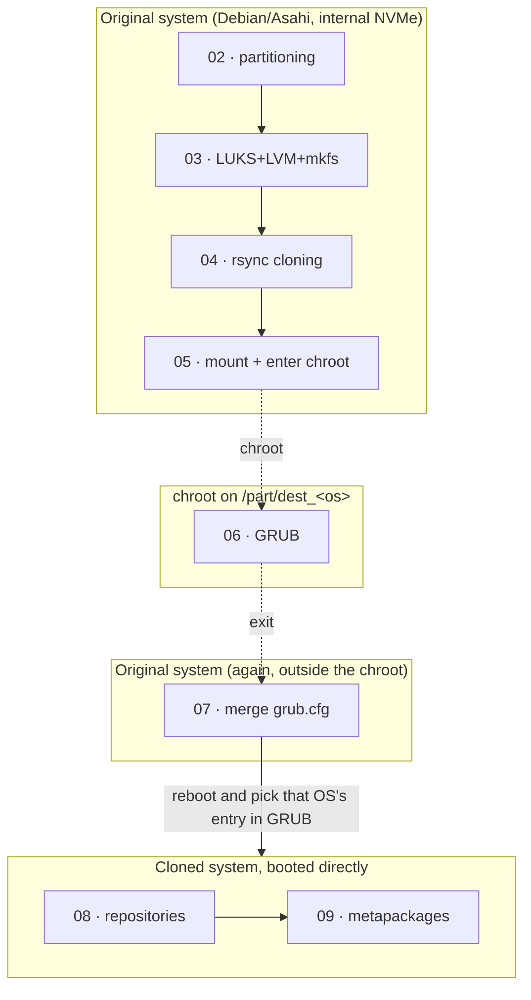

# Architecture — base_inst_kali

## Project goal

Turn an external USB disk into a **Kali Linux** and/or **Parrot OS**
(arm64) installation, cloned from a **Debian/Asahi** base already
installed and up to date on the internal disk (NVMe) of an Apple
Silicon MacBook Air, following the method described at
<https://wiki.debian.org/InstallingDebianOn/Apple/M1> (Debian's Bananas
project). The external disk can host **several offensive systems at
once**, in independent partitions.

> **Non-negotiable prerequisite**: the MacBook must already have Asahi
> Linux/Debian installed and up to date on the internal NVMe. This
> repository does not install it; it assumes it already exists. See the
> README for the link to the official guide.

This framework wraps the process in:

- a **single menu** (`install.sh`) with persistent progress,
- per-step **logging** plus a master log,
- a lightweight **i18n** layer (currently English-only, `i18n/strings.en.sh`),
- a **UI** layer (`whiptail` with plain-text fallback),
- an **operating system catalogue** (`lib/os_catalog.sh`) that lets you
  add Kali, Parrot, or others without touching the rest of the code.

## Two step categories: "host" and "per operating system"

With more than one OS on the same disk, not every step makes sense as
"do it once". That's why steps are split into two groups:

| Group | Steps | When they run |
|---|---|---|
| **Host** | 00, 01, 01a | Once. They don't depend on which OS(es) you'll clone afterwards. |
| **Per OS** | 02–09 | Repeated **for each operating system** you install on the disk. Each one keeps its own progress, its own partitions, its own LVM group, etc. |

Host step state is stored with plain keys (`STEP_00_STATUS`, ...). Per-OS
step state is namespaced by the OS id (`OS_kali_STEP_02_STATUS`,
`OS_parrot_STEP_02_STATUS`, ...), so Kali's progress and Parrot's never
overwrite each other (`lib/state.sh`, `os_*` functions).

The menu (`install.sh`) keeps an "active operating system"
(`ACTIVE_OS` in the state): the 02–09 steps you see and run at any given
time are always the active OS's. Switching the active OS (the
"Operating systems" menu option) doesn't erase anyone's progress; it
only changes which one is shown/run.

## Collision-free partitioning across operating systems

The first three original scripts assumed an empty disk and always
created partitions 1, 2 and 3. With several operating systems on the
same disk that no longer holds: the first time step 02 runs for a given
OS, it computes the next free partition numbers on the disk (`sgdisk -p`
plus the highest existing partition number) and stores them
(`os_state_set $OS PART_EFI/PART_BOOT/PART_ROOT`) for reuse in later
steps or retries. So if Kali takes partitions 1-3, Parrot automatically
lands on 4-6, with no manual bookkeeping required.

Likewise, `lib/os_catalog.sh` deterministically derives, from the OS id:

| Item | Example for `kali` | Example for `parrot` |
|---|---|---|
| EFI partition label (max. 11 chars, FAT) | `EFI-KALI` | `EFI-PARROT` |
| Boot partition label | `boot_kali` | `boot_parrot` |
| Root partition label | `rootfs_kali` | `rootfs_parrot` |
| LVM volume group | `vgkali` | `vgparrot` |
| LUKS mapper name | `kali_root_crypt` | `parrot_root_crypt` |
| Temporary mount point | `/part/dest_kali` | `/part/dest_parrot` |

This avoids any name collision if both systems happen to be mounted or
open at the same time (for example, when merging one's `grub.cfg` right
after working on the other).

## Three different execution environments (per OS)

For a given OS, its steps 02-09 don't all run on the same running
operating system. There are three contexts:



- **02–05**: run while booted into the Mac's normal Debian/Asahi
  system. The external disk is only mounted at `/part/dest_<os>`, not
  booted.
- **06**: runs *inside* the `chroot` opened by step 05. Its `BASE_DIR`
  resolves to `/base_inst_kali_installer` (a full copy of the project
  that step 05 makes with `rsync`), not to the host's original path.
- **07**: back on the host, after exiting the chroot with `exit`. The
  external disk is still mounted at `/part/dest_<os>` at this point.
- **08–09**: run having **already booted that cloned system** directly
  from the external disk (picking that entry from the GRUB menu after
  step 07's reboot). It's a different process, with its own
  `/var/lib/base_inst_kali/state.conf`.

### Why state needs manual syncing between environments

`state_get`/`state_set` always read and write
`/var/lib/base_inst_kali/state.conf` **on the filesystem the script
happens to be running on at that moment**. Since there are three
different "views" of the disk (host, chroot, already-booted cloned
system), without help that file wouldn't be the same across all three:

- Step 05 mounts the external disk at `/part/dest_<os>` and copies the
  whole project there — from that point on, writing to `/var/lib/...`
  from inside the `chroot` **is the same** as writing to
  `/part/dest_<os>/var/lib/...` from outside, because it's the same
  mounted filesystem. That's why step 06 can mark its own progress
  consistently with what the cloned system will see once booted.
- But step 07 runs on the **host**, not in the chroot, so its
  `mark_os_step_done` calls write to the host's `/var/lib/...`, not the
  external disk's. That's why, at the end of steps 04 and 07,
  `sync_state_to_mount /part/dest_<os>` is called explicitly
  (`lib/state.sh`): it copies the host's current `state.conf` into the
  mounted external disk, so that when you boot from that disk (steps
  08–09) the installer remembers what was already done — including,
  incidentally, the progress of *other* operating systems on the same
  disk (harmless extra information, it doesn't affect the OS that
  boots).

### Why step 06 doesn't block the host menu

The main menu figures out which step is "next" by looking at the
**host's** `state.conf`. Since step 06 writes its mark to the chroot's
filesystem (which at that point coincides with `/part/dest_<os>`, not
the host's root), the host will never see that "done" reflected in its
own state. That's why `install.sh` keeps `NO_GATE_STEPS=("06")`: step 07
isn't blocked waiting for a mark that will never show up on the host.

## Merging `grub.cfg` with several operating systems

Step 07 captures the target's native GRUB entries (the first complete
`BEGIN`/`END /etc/grub.d/10_linux` block from its own `grub.cfg`) and
bakes them into a small, persistent script at
`/etc/grub.d/46_iac_merged_<target>` — not by splicing text directly
into the host's `grub.cfg` (an earlier version did that, one-time;
that copy silently disappeared the next time *anything* else ran
`update-grub` on the host — a kernel update, or step 07b's own
`update-grub` when cross-linking a completely different target —
since it was never captured in `/etc/grub.d/` at all). With the
per-target script in place, every OS already processed for this host
keeps showing up automatically on every future `update-grub`, without
needing that target's disk mounted or step 07 re-run for it.

## Two independent GRUBs, and how 07b bridges them

Kali/Parrot need Debian/Asahi booted to be cloned, and Ubuntu needs
Ubuntu/Asahi booted (`OS_SOURCE_BASE`, `verify_source_base`, see below).
Since these are two separate internal installs with their own root
filesystem, they also end up with two separate, independently
maintained `/boot/grub/grub.cfg` files. Step 07's merge always writes
into whichever one is currently booted (the "host" at that moment):
processing `kali`/`parrot` while booted in Debian/Asahi merges into
Debian's own `grub.cfg`; processing `ubuntu` while booted in Ubuntu/Asahi
merges into Ubuntu's own `grub.cfg`. **There is no single, unified GRUB
menu across both internal bases** — picking between "Kali/Parrot mode"
and "Ubuntu+SIFT mode" happens at the Mac's own boot-entry level first
(which internal install to boot), and only then does that install's own
GRUB offer its own native + external-disk entries.

`steps/07b_grub_cross_merge.sh` (optional, listed in `NO_GATE_STEPS`)
bridges the two without duplicating any menuentry text: it drops a
small script into the *sibling* base's `/etc/grub.d/` that does
`search --fs-uuid` + `configfile` against the current host's own
`grub.cfg`. Because it loads that file live at boot time rather than
copying its contents, it never goes stale — future kernel updates or
additional OS merges on either base show up automatically on both
sides, with no re-sync step needed. This chainload only needs the
standard `part_gpt`/`ext2` GRUB modules (present by default on any
modern GRUB EFI install); the `cryptodisk`/`luks`/`lvm` modules are only
needed one level deeper, inside whichever `grub.cfg` ends up being
loaded once the chainload entry is picked — already verified present on
a stock Ubuntu/Asahi install.

## Source base verification (Kali/Parrot vs. Ubuntu)

Kali and Parrot are obtained by **converting** an already-cloned
Debian/Asahi base (adding their repository on top, steps 08-09). Ubuntu
is different: it's **cloned as-is** from a genuine, separate Ubuntu/Asahi
installation, with no meaningful conversion possible. This introduces a
dependency that didn't exist when there was only one kind of source:
**which system must be booted on the internal disk** depends on which
`$TARGET_OS` is being processed.

`lib/os_catalog.sh` keeps the mapping:

```bash
declare -A OS_SOURCE_BASE=(
    [kali]="debian"
    [parrot]="debian"
    [ubuntu]="ubuntu"
)
```

and the `verify_source_base "$TARGET_OS"` function reads `ID=` from the
booted system's `/etc/os-release` and compares it against the expected
base. This is an intentionally **blocking** check (not a dismissable
warning): it's invoked at the start of steps 02, 03 and 04 (right before
partitioning, formatting and cloning), because a wrong source at step 04
would mean literally copying the wrong system onto already-destructive
partitions — there's no safe "continue anyway" there.

## Modules (`lib/`)

| File | Responsibility |
|---|---|
| `state.sh` | Progress and language persistence. Plain functions (`state_get/set`, `mark_step_done`, `step_status`) for host steps, and OS-namespaced ones (`os_state_get/set`, `mark_os_step_done`, `os_step_status`, `os_list_add/get`) for steps 02-09. `sync_state_to_mount` copies the state to the mounted external disk. |
| `os_catalog.sh` | List of supported operating systems (`SUPPORTED_OS`) and functions that derive partition/VG/mapper/mountpoint names from the OS id. Includes `OS_SOURCE_BASE` and `verify_source_base` (see previous section). The single place to add a new operating system (see `docs/OPERATING_SYSTEMS.md`). |
| `i18n.sh` | Translation engine. `i18n_load <lang>` loads `i18n/strings.<lang>.sh` into the `STRINGS[]` associative array (currently only `en` ships). `t key arg...` translates and interpolates with `printf`. |
| `ui.sh` | UI abstraction: `ui_msgbox`, `ui_yesno`, `ui_inputbox`, `ui_passwordbox`, `ui_menu`. Detects whether `whiptail` is installed and falls back to `read`/`echo` if not (see below). |
| `common.sh` | `set -e -u -o pipefail` + `trap ERR`, logging (`log_info/warn/error/ok`, `init_step_log`, `run_cmd`), `require_root`, `confirm_yes_no`, `confirm_destructive`, `pause_enter`. `install_cast_arm64` (one-off installer for `cast`/ekristen, used for SIFT on Ubuntu, resolving the latest version without the GitHub API). |

## Whiptail: when it's used and when it isn't

- There is no bootstrap that force-installs `whiptail`. In steps 00 and
  01 (before it exists on the system) everything naturally works in
  text mode.
- Step 01 adds it to the base package list (`apt install ... whiptail`).
- From step 01a onward, each script checks again whether it's available
  (`ui_detect_mode`) and uses dialogs automatically if so.
- The raw output of long commands (`apt`, `rsync`, `cryptsetup`,
  `sgdisk`...) **never** goes through whiptail — it's left as plain
  terminal output, because wrapping it in a dialog box would break
  visibility of real progress. `pause_enter` doesn't use whiptail for
  the same reason.

## Conventions to keep when adding new steps or operating systems

1. Any irreversible disk operation (partitioning, formatting,
   `luksFormat`) must go through `confirm_destructive`.
2. No sensitive data (passwords, passphrases) should be written outside
   the system's own configuration files, and those files must end up
   with `600` permissions.
3. Any command that can fail must be wrapped in
   `run_cmd "description" command...`.
4. Any `grep`/`awk` whose result feeds a variable assignment must
   account for the fact that, with `pipefail` on, "nothing found" fails
   the line — add `|| true` when "empty" is a valid outcome and check it
   explicitly afterwards.
5. Any name derived from the operating system (partition, VG, mapper,
   mountpoint) must come from `lib/os_catalog.sh`, never hardcoded, so
   several systems can coexist without colliding.
